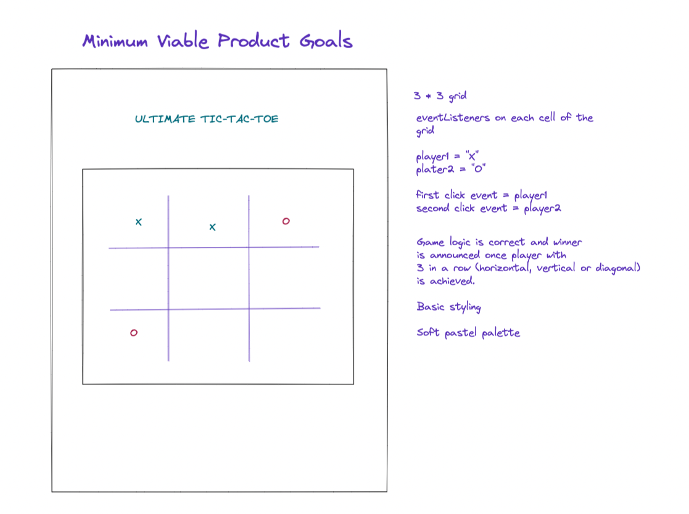
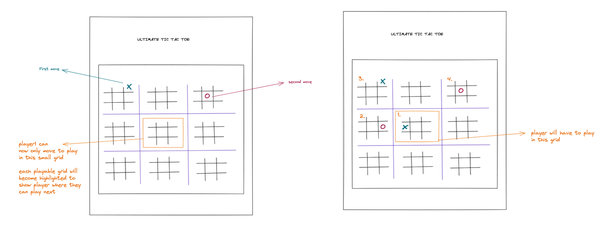

###  General Assembly, Software Engineering Immersive

<h2>Overview 🗺</h2>

This was my first project for the General Assembly Software Engineering Immersive course. I chose to build 'Ultimate Tic-Tac-Toe' which is inspired by the classic children's game. 

In this variation, each cell of the Tic Tac Toe board is a game of Tic-Tac-Toe. The players have to win a row of three of the smaller cells to win the ultimate game.

The <em>lucky</em> first player can choose to go anywhere they want on the board. The second player, however, must go to the corresponding cell that the first player previously went in.

This makes it quite a complex game to win, as well as code.

<h2>Rules of the Game 🎲</h2>
<ul>
<li>Player1 can play anywhere on the board </li>
<li>Player2 has to play in the big grid corresponding to the original move of player1 </li>
<li>Player1 has to follow step 2 (basically where one player plays, forces where the next player can play)</li>
<li>Players may send the other player to a grid that is already filled, if  this is the case then that player can pick where they go (freedom to choose where you play)</li>
<li>First player to win 3 in a row in a small game wins that grid</li<>
<li>If player wins 3 games in a row then they win the ultimate game</li>
</ul>

<h2>Project Brief 🦺</h2>
<ul>
  <li> The game should be playable for two players on the same computer, taking turns to make their moves</li>
  <li> The winner should be displayed when the game is over</li>
</ul>

<h2>Technologies Used 🕹</h2> 
<ul>
  <li>JavaScript</li>
  <li>HTML</li>
  <li>CSS</li>
  <li>Git</li>
</ul>

<h2>Minimum Viable Product Goal 🧩</h2>

<ul>
<li>Grid is generated, initially only one 3 * 3 grid for basic Tic-Tac-Toe game</li>
<li>JavaScript logic works as per the game rules on only one Tic-Tac-Toe grid</li>
<li>Basic styling</li>
</ul>

<h2>Ultimate Goal 🚀</h2>
<ul>
<li>Full 3 * 3 grid, each with 3 * 3 grid nested within them</li>
<li>JavaScript logic works for smaller grid games and the larger, ultimate game</li>
<li>JavaScript logic covers small winner, big winner as well as when players can go anywhere on the board</li>
<li>Simplistic styling which emulates the nature of the game, with 80s inspired pastel palette 🎨</li>
</ul>

<h2>Whiteboarded Concept 📌</h2>
<h4>Minimum Viable Product Concept</h4>
 

<h4>Ultimate Goal Concept</h4>
 

<h2>Exciting Functions</h2>

<h2>Challenges and Wins</h2>

