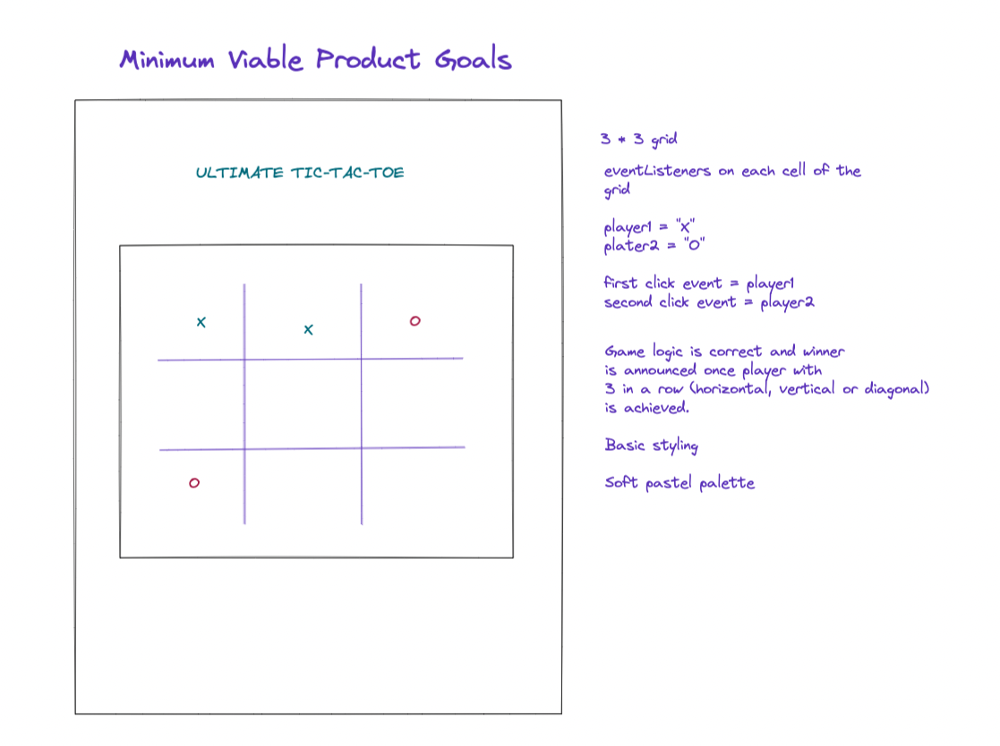
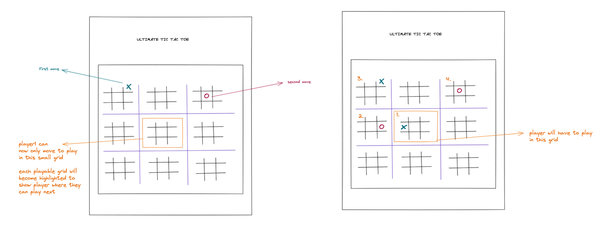

<h2>MINIMUM VIABLE PRODUCT GOALS 🧩</h2>

<ul>
<li>Grid is generated, initially only one grid for normal tic-tac-toe</li>
<li>JS logic works as per the game rules on only one tic-tac-toe grid</li>
<li>Basic styling</li>
</ul>

<h2>ULTIMATE GOALS 🚀</h2>
<ul>
<li>Full 81 cell grid</li>
<li>JS logic works for smaller grid games and the larger, ultimate game</li>
<li>Awesome styling, possibly 80s inspired styling with pastel palette 🎨</li>
<li>Possibly cool theme song, low-fi hip hop 🎶</li>
</ul>

<h2>WHITEBOARDED CONCEPT 📌</h2>
<h4>Minimum Viable Product Concept</h4>
 

<h4>Ultimate Goal Concept</h4>
 

<h2>RULE OF THE GAME 🎲</h2>
<ul>
<li>Player1 can play anywhere on the board </li>
<li>Player2 has to play in the big grid corresponding to the original move of player1 </li>
<li>Player1 has to follow step 2 (basically where one player plays, forces where the next player can play)</li>
<li>Players may send the other player to a grid that is already filled, if  this is the case then
    that player can pick where they go (freedom to choose where you play)</li>
<li>First player to win 3 in a row in a small game wins that grid</li<>
<li>If player wins 3 games in a row then they win the ultimate game</li>

</ul>